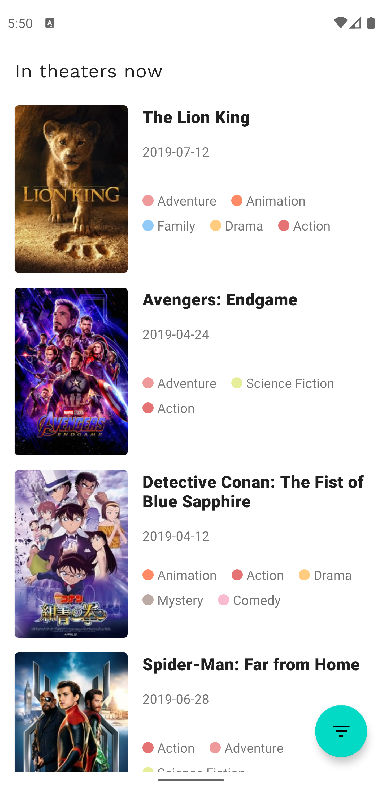

# Now Playing Movies

- Taget API: 29 (Android Q)
- Data Source: [TMDB](https://www.themoviedb.org/?language=en-US)

##### UI, Widgets
- AndroidX
- RecyclerView
- [Google Material Design](https://material.io/develop/android/)
- [Facebook Shimmer](https://github.com/facebook/shimmer-android)

##### Architecture, Lifecycle, Persistence
- Android Navigation 
- Android Data Binding
- Android Lifecycle
- Android ViewModel
- Android LiveData
- Android Room

##### Async
- Kotlin Coroutine

##### Internet, Http Connection, JSON Parsing
- [Square Retrofit](https://github.com/square/retrofit)
- [Square Moshi](https://github.com/square/moshi)
- [Glide](https://github.com/bumptech/glide)

##### Logging
- [JakeWharton Timber](https://github.com/JakeWharton/timber)

  

 